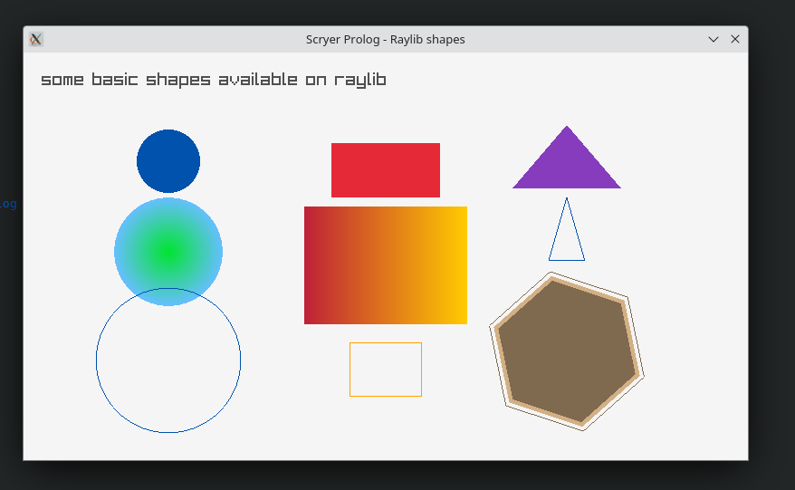

# raylib-prolog



Raylib bindings to Scryer Prolog using [library(ffi)](https://www.scryer.pl/ffi.html)

Try it! You need a compiled libraylib.so file

```
scryer-prolog samples.pl
?- hello_world.
?- shapes.
?- texture.
?- core_input_keys.
```
